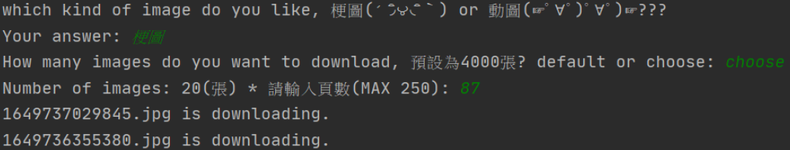

# Multi-Threading Project

> `2022.05.02`
> 這是一個利用thread為主題編寫的爬蟲小作品

## Description
利用 python 結合多執行緒 multithread， 爬取【Meme 梗圖倉庫】的梗圖及 gif，使下載圖 片的速度加速，一開始原本使用生產者-消費者的方法跑，但之後讓下載每一張圖片都用一條 thread 跑，速度變得更快了。

## Usage
執行程式後，可以選擇想要下載的圖片，預設會下載 4000 張圖片，或可自行選擇頁數，並將圖片儲 存於 images 的資料夾，如果沒有資料夾會自動創建。

## Flow Chart

<!-- 實際執行狀況 -->
## Actual Execution
